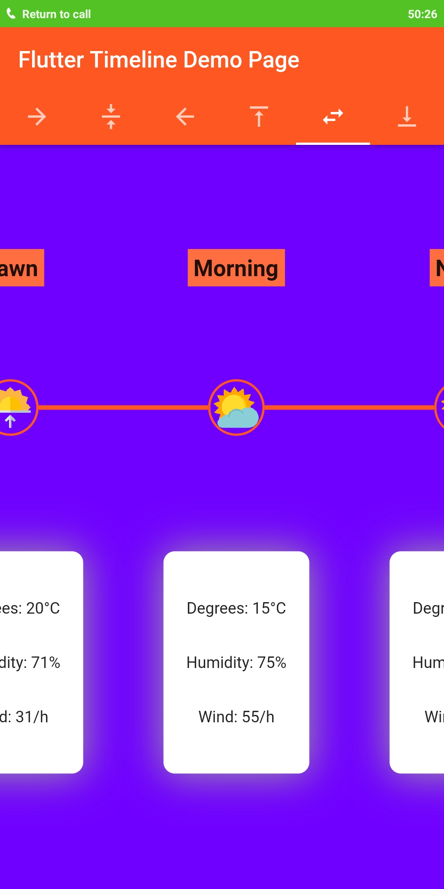

# timeline_widget

This pub creates beautiful timeline views in six formats (left, right, center (horizontal and vertical) , top, bottom) with customizable image, widgets, color, constraints etc.

## Screenshots

   <br>
  

## Usage

[Example](https://github.com/JayTWWM/Timeline-Widget-Flutter/blob/master/example/example.dart)

To use this package :

* add the dependency to your [pubspec.yaml] file.

```yaml
  dependencies:
    flutter:
      sdk: flutter
    timeline_widget:
```

### How to use

#### Vertical Timelines

##### Left Aligned TimelineView

```dart
TimelineView(
  scrollController:
      ScrollController(initialScrollOffset: 300, keepScrollOffset: true),
  align: TimelineAlign.leftAlign,
  lineWidth: 4,
  lineColor: Colors.deepOrange,
  imageBorderColor: Colors.deepOrange,
  image: [
    Container(
        padding: EdgeInsets.all(15),
        child: Image.asset("assets/pre-breakfast-image.png")),
    Container(
        padding: EdgeInsets.all(15),
        child: Image.asset("assets/breakfast-image.png")),
    Container(
        padding: EdgeInsets.all(15),
        child: Image.asset("assets/pre-lunch-image.png")),
    Container(
        padding: EdgeInsets.all(15),
        child: Image.asset("assets/lunch-image.png")),
    Container(
        padding: EdgeInsets.all(15),
        child: Image.asset("assets/evening-snack-image.png")),
    Container(
        padding: EdgeInsets.all(20),
        child: Image.asset("assets/dinner-image.png")),
  ],
  height: 150,
  width: MediaQuery.of(context).size.width,
  imageHeight: 50,
  children: [
    Container(
        margin: EdgeInsets.fromLTRB(0, 0, 20, 0),
        child: _widgetWeather(20, 71, 31)),
    Container(
        margin: EdgeInsets.fromLTRB(0, 0, 20, 0),
        child: _widgetWeather(15, 75, 55)),
    Container(
        margin: EdgeInsets.fromLTRB(0, 0, 20, 0),
        child: _widgetWeather(25, 73, 30)),
    Container(
        margin: EdgeInsets.fromLTRB(0, 0, 20, 0),
        child: _widgetWeather(22, 65, 35)),
    Container(
        margin: EdgeInsets.fromLTRB(0, 0, 20, 0),
        child: _widgetWeather(21, 55, 32)),
    Container(
        margin: EdgeInsets.fromLTRB(0, 0, 20, 0),
        child: _widgetWeather(20, 65, 35)),
  ],
),
```

##### Centered TimelineView

```dart
TimelineViewCenter(
  scrollController:
      ScrollController(initialScrollOffset: 200, keepScrollOffset: true),
  horizontalAxisAlignment: MainAxisAlignment.spaceEvenly,
  lineWidth: 4,
  lineColor: Colors.deepOrange,
  imageBorderColor: Colors.deepOrange,
  image: [
    Container(
        padding: EdgeInsets.all(15),
        child: Image.asset("assets/pre-breakfast-image.png")),
    Container(
        padding: EdgeInsets.all(15),
        child: Image.asset("assets/breakfast-image.png")),
    Container(
        padding: EdgeInsets.all(15),
        child: Image.asset("assets/pre-lunch-image.png")),
    Container(
        padding: EdgeInsets.all(15),
        child: Image.asset("assets/lunch-image.png")),
    Container(
        padding: EdgeInsets.all(15),
        child: Image.asset("assets/evening-snack-image.png")),
    Container(
        padding: EdgeInsets.all(20),
        child: Image.asset("assets/dinner-image.png")),
  ],
  height: 150,
  width: MediaQuery.of(context).size.width,
  imageHeight: 50,
  rightChildren: [
    _widgetWeather(20, 71, 31),
    _widgetWeather(15, 75, 55),
    _widgetWeather(25, 73, 30),
    _widgetWeather(22, 65, 35),
    _widgetWeather(21, 55, 32),
    _widgetWeather(20, 65, 35),
  ],
  leftChildren: [
    Container(
      color: Colors.deepOrangeAccent,
      margin: EdgeInsets.fromLTRB(0, 10, 0, 0),
      padding: EdgeInsets.all(5),
      child: Text(
        'Dawn',
        style: TextStyle(fontWeight: FontWeight.bold, fontSize: 20),
      ),
    ),
    Container(
      color: Colors.deepOrangeAccent,
      margin: EdgeInsets.fromLTRB(0, 10, 0, 0),
      padding: EdgeInsets.all(5),
      child: Text(
        'Morning',
        style: TextStyle(fontWeight: FontWeight.bold, fontSize: 20),
      ),
    ),
    Container(
      color: Colors.deepOrangeAccent,
      margin: EdgeInsets.fromLTRB(0, 10, 0, 0),
      padding: EdgeInsets.all(5),
      child: Text(
        'Noon',
        style: TextStyle(fontWeight: FontWeight.bold, fontSize: 20),
      ),
    ),
    Container(
      color: Colors.deepOrangeAccent,
      margin: EdgeInsets.fromLTRB(0, 10, 0, 0),
      padding: EdgeInsets.all(5),
      child: Text(
        'Afternoon',
        style: TextStyle(fontWeight: FontWeight.bold, fontSize: 20),
      ),
    ),
    Container(
      color: Colors.deepOrangeAccent,
      margin: EdgeInsets.fromLTRB(0, 10, 0, 0),
      padding: EdgeInsets.all(5),
      child: Text(
        'Evening',
        style: TextStyle(fontWeight: FontWeight.bold, fontSize: 20),
      ),
    ),
    Container(
      color: Colors.deepOrangeAccent,
      margin: EdgeInsets.fromLTRB(0, 10, 0, 0),
      padding: EdgeInsets.all(5),
      child: Text(
        'Dusk',
        style: TextStyle(fontWeight: FontWeight.bold, fontSize: 20),
      ),
    ),
  ],
),
```

##### Right Aligned TimelineView

```dart
TimelineView(
  scrollController:
      ScrollController(initialScrollOffset: 200, keepScrollOffset: true),
  align: TimelineAlign.rightAlign,
  lineWidth: 4,
  lineColor: Colors.deepOrange,
  imageBorderColor: Colors.deepOrange,
  image: [
    Container(
        padding: EdgeInsets.all(15),
        child: Image.asset("assets/pre-breakfast-image.png")),
    Container(
        padding: EdgeInsets.all(15),
        child: Image.asset("assets/breakfast-image.png")),
    Container(
        padding: EdgeInsets.all(15),
        child: Image.asset("assets/pre-lunch-image.png")),
    Container(
        padding: EdgeInsets.all(15),
        child: Image.asset("assets/lunch-image.png")),
    Container(
        padding: EdgeInsets.all(15),
        child: Image.asset("assets/evening-snack-image.png")),
    Container(
        padding: EdgeInsets.all(20),
        child: Image.asset("assets/dinner-image.png")),
  ],
  height: 150,
  width: MediaQuery.of(context).size.width,
  imageHeight: 50,
  children: [
    Container(
        margin: EdgeInsets.fromLTRB(20, 0, 0, 0),
        child: _widgetWeather(20, 71, 31)),
    Container(
        margin: EdgeInsets.fromLTRB(20, 0, 0, 0),
        child: _widgetWeather(15, 75, 55)),
    Container(
        margin: EdgeInsets.fromLTRB(20, 0, 0, 0),
        child: _widgetWeather(25, 73, 30)),
    Container(
        margin: EdgeInsets.fromLTRB(20, 0, 0, 0),
        child: _widgetWeather(22, 65, 35)),
    Container(
        margin: EdgeInsets.fromLTRB(20, 0, 0, 0),
        child: _widgetWeather(21, 55, 32)),
    Container(
        margin: EdgeInsets.fromLTRB(20, 0, 0, 0),
        child: _widgetWeather(20, 65, 35)),
  ],
),
```

#### Horizontal Timelines

##### Bottom Aligned TimelineView

```dart
TimelineView(
  scrollDirection: Axis.horizontal,
  scrollController:
      ScrollController(initialScrollOffset: 0, keepScrollOffset: true),
  align: TimelineAlign.bottomAlign,
  lineWidth: 4,
  lineColor: Colors.deepOrange,
  imageBorderColor: Colors.deepOrange,
  image: [
    Container(
        padding: EdgeInsets.all(15),
        child: Image.asset("assets/pre-breakfast-image.png")),
    Container(
        padding: EdgeInsets.all(15),
        child: Image.asset("assets/breakfast-image.png")),
    Container(
        padding: EdgeInsets.all(15),
        child: Image.asset("assets/pre-lunch-image.png")),
    Container(
        padding: EdgeInsets.all(15),
        child: Image.asset("assets/lunch-image.png")),
    Container(
        padding: EdgeInsets.all(15),
        child: Image.asset("assets/evening-snack-image.png")),
    Container(
        padding: EdgeInsets.all(20),
        child: Image.asset("assets/dinner-image.png")),
  ],
  height: MediaQuery.of(context).size.width,
  width: 200,
  imageHeight: 50,
  children: [
    Container(
        margin: EdgeInsets.fromLTRB(20, 0, 0, 0),
        child: _widgetWeather(20, 71, 31)),
    Container(
        margin: EdgeInsets.fromLTRB(20, 0, 0, 0),
        child: _widgetWeather(15, 75, 55)),
    Container(
        margin: EdgeInsets.fromLTRB(20, 0, 0, 0),
        child: _widgetWeather(25, 73, 30)),
    Container(
        margin: EdgeInsets.fromLTRB(20, 0, 0, 0),
        child: _widgetWeather(22, 65, 35)),
    Container(
        margin: EdgeInsets.fromLTRB(20, 0, 0, 0),
        child: _widgetWeather(21, 55, 32)),
    Container(
        margin: EdgeInsets.fromLTRB(20, 0, 0, 0),
        child: _widgetWeather(20, 65, 35)),
  ],
),
```

##### Centered TimelineView

```dart
TimelineViewCenter(
  scrollDirection: Axis.horizontal,
  scrollController:
      ScrollController(initialScrollOffset: 0, keepScrollOffset: true),
  horizontalAxisAlignment: MainAxisAlignment.spaceEvenly,
  lineWidth: 4,
  lineColor: Colors.deepOrange,
  imageBorderColor: Colors.deepOrange,
  image: [
    Container(
        padding: EdgeInsets.all(15),
        child: Image.asset("assets/pre-breakfast-image.png")),
    Container(
        padding: EdgeInsets.all(15),
        child: Image.asset("assets/breakfast-image.png")),
    Container(
        padding: EdgeInsets.all(15),
        child: Image.asset("assets/pre-lunch-image.png")),
    Container(
        padding: EdgeInsets.all(15),
        child: Image.asset("assets/lunch-image.png")),
    Container(
        padding: EdgeInsets.all(15),
        child: Image.asset("assets/evening-snack-image.png")),
    Container(
        padding: EdgeInsets.all(20),
        child: Image.asset("assets/dinner-image.png")),
  ],
  height: MediaQuery.of(context).size.width,
  width: 200,
  imageHeight: 50,
  rightChildren: [
    _widgetWeather(20, 71, 31),
    _widgetWeather(15, 75, 55),
    _widgetWeather(25, 73, 30),
    _widgetWeather(22, 65, 35),
    _widgetWeather(21, 55, 32),
    _widgetWeather(20, 65, 35),
  ],
  leftChildren: [
    Container(
      color: Colors.deepOrangeAccent,
      margin: EdgeInsets.fromLTRB(0, 10, 0, 0),
      padding: EdgeInsets.all(5),
      child: Text(
        'Dawn',
        style: TextStyle(fontWeight: FontWeight.bold, fontSize: 20),
      ),
    ),
    Container(
      color: Colors.deepOrangeAccent,
      margin: EdgeInsets.fromLTRB(0, 10, 0, 0),
      padding: EdgeInsets.all(5),
      child: Text(
        'Morning',
        style: TextStyle(fontWeight: FontWeight.bold, fontSize: 20),
      ),
    ),
    Container(
      color: Colors.deepOrangeAccent,
      margin: EdgeInsets.fromLTRB(0, 10, 0, 0),
      padding: EdgeInsets.all(5),
      child: Text(
        'Noon',
        style: TextStyle(fontWeight: FontWeight.bold, fontSize: 20),
      ),
    ),
    Container(
      color: Colors.deepOrangeAccent,
      margin: EdgeInsets.fromLTRB(0, 10, 0, 0),
      padding: EdgeInsets.all(5),
      child: Text(
        'Afternoon',
        style: TextStyle(fontWeight: FontWeight.bold, fontSize: 20),
      ),
    ),
    Container(
      color: Colors.deepOrangeAccent,
      margin: EdgeInsets.fromLTRB(0, 10, 0, 0),
      padding: EdgeInsets.all(5),
      child: Text(
        'Evening',
        style: TextStyle(fontWeight: FontWeight.bold, fontSize: 20),
      ),
    ),
    Container(
      color: Colors.deepOrangeAccent,
      margin: EdgeInsets.fromLTRB(0, 10, 0, 0),
      padding: EdgeInsets.all(5),
      child: Text(
        'Dusk',
        style: TextStyle(fontWeight: FontWeight.bold, fontSize: 20),
      ),
    ),
  ],
),
```

##### Top Aligned TimelineView

```dart
TimelineView(
  scrollDirection: Axis.horizontal,
  scrollController:
      ScrollController(initialScrollOffset: 0, keepScrollOffset: true),
  align: TimelineAlign.topAlign,
  lineWidth: 4,
  lineColor: Colors.deepOrange,
  imageBorderColor: Colors.deepOrange,
  image: [
    Container(
        padding: EdgeInsets.all(15),
        child: Image.asset("assets/pre-breakfast-image.png")),
    Container(
        padding: EdgeInsets.all(15),
        child: Image.asset("assets/breakfast-image.png")),
    Container(
        padding: EdgeInsets.all(15),
        child: Image.asset("assets/pre-lunch-image.png")),
    Container(
        padding: EdgeInsets.all(15),
        child: Image.asset("assets/lunch-image.png")),
    Container(
        padding: EdgeInsets.all(15),
        child: Image.asset("assets/evening-snack-image.png")),
    Container(
        padding: EdgeInsets.all(20),
        child: Image.asset("assets/dinner-image.png")),
  ],
  height: MediaQuery.of(context).size.width,
  width: 200,
  imageHeight: 50,
  children: [
    Container(
        margin: EdgeInsets.fromLTRB(20, 0, 0, 0),
        child: _widgetWeather(20, 71, 31)),
    Container(
        margin: EdgeInsets.fromLTRB(20, 0, 0, 0),
        child: _widgetWeather(15, 75, 55)),
    Container(
        margin: EdgeInsets.fromLTRB(20, 0, 0, 0),
        child: _widgetWeather(25, 73, 30)),
    Container(
        margin: EdgeInsets.fromLTRB(20, 0, 0, 0),
        child: _widgetWeather(22, 65, 35)),
    Container(
        margin: EdgeInsets.fromLTRB(20, 0, 0, 0),
        child: _widgetWeather(21, 55, 32)),
    Container(
        margin: EdgeInsets.fromLTRB(20, 0, 0, 0),
        child: _widgetWeather(20, 65, 35)),
  ],
),
```

# License

    Copyright 2020 Jay Mehta and Vaidehi Vatsaraj

    Licensed under the Apache License, Version 2.0 (the "License");
    you may not use this file except in compliance with the License.
    You may obtain a copy of the License at

        http://www.apache.org/licenses/LICENSE-2.0

    Unless required by applicable law or agreed to in writing, software
    distributed under the License is distributed on an "AS IS" BASIS,
    WITHOUT WARRANTIES OR CONDITIONS OF ANY KIND, either express or implied.
    See the License for the specific language governing permissions and
    limitations under the License.


## Getting Started

This project is a starting point for a Dart
[package](https://flutter.dev/developing-packages/),
a library module containing code that can be shared easily across
multiple Flutter or Dart projects.

For help getting started with Flutter, view our 
[online documentation](https://flutter.dev/docs), which offers tutorials, 
samples, guidance on mobile development, and a full API reference.

## Example

As time based...

``` dart
import 'package:flutter/material.dart';
import 'package:timeline_widget/timeline_widget.dart';

void main() {
  runApp(MyApp());
}

class MyApp extends StatelessWidget {
  @override
  Widget build(BuildContext context) {
    return MaterialApp(
      title: 'Flutter Timeline Demo',
      debugShowCheckedModeBanner: false,
      theme: ThemeData(
        primarySwatch: Colors.deepOrange,
        visualDensity: VisualDensity.adaptivePlatformDensity,
      ),
      home: MyHomePage(title: 'Flutter Timeline Demo Page'),
    );
  }
}

class MyHomePage extends StatefulWidget {
  MyHomePage({Key key, this.title}) : super(key: key);

  final String title;

  @override
  _MyHomePageState createState() => _MyHomePageState();
}

class _MyHomePageState extends State<MyHomePage> {
  @override
  void initState() {
    super.initState();
  }

  @override
  Widget build(BuildContext context) {
    return DefaultTabController(
      length: 6,
      child: Scaffold(
          appBar: AppBar(
            bottom: TabBar(
              tabs: [
                Tab(icon: Icon(Icons.arrow_forward)),
                Tab(icon: Icon(Icons.vertical_align_center)),
                Tab(icon: Icon(Icons.arrow_back)),
                Tab(icon: Icon(Icons.vertical_align_top)),
                Tab(icon: Icon(Icons.swap_horiz)),
                Tab(icon: Icon(Icons.vertical_align_bottom)),
              ],
            ),
            title: Text(widget.title),
          ),
          body: Container(
            color: Color.fromARGB(255, 111, 0, 255),
            child: TabBarView(
              children: [
                _timelineviewRight(),
                _timelineviewCenter(),
                _timelineviewLeft(),
                _timelineviewTop(),
                _timelineviewCenterHorizontal(),
                _timelineviewBottom()
              ],
            ),
          )),
    );
  }

  Widget _timelineviewLeft() {
    return Container(
      padding: EdgeInsets.fromLTRB(0, 0, 30, 0),
      child: TimelineView(
        scrollController:
            ScrollController(initialScrollOffset: 0, keepScrollOffset: true),
        align: TimelineAlign.leftAlign,
        lineWidth: 4,
        lineColor: Colors.deepOrange,
        imageBorderColor: Colors.deepOrange,
        image: [
          Container(
              padding: EdgeInsets.all(15),
              child: Image.asset("assets/pre-breakfast-image.png")),
          Container(
              padding: EdgeInsets.all(15),
              child: Image.asset("assets/breakfast-image.png")),
          Container(
              padding: EdgeInsets.all(15),
              child: Image.asset("assets/pre-lunch-image.png")),
          Container(
              padding: EdgeInsets.all(15),
              child: Image.asset("assets/lunch-image.png")),
          Container(
              padding: EdgeInsets.all(15),
              child: Image.asset("assets/evening-snack-image.png")),
          Container(
              padding: EdgeInsets.all(20),
              child: Image.asset("assets/dinner-image.png")),
        ],
        height: 150,
        width: MediaQuery.of(context).size.width,
        imageHeight: 50,
        children: [
          Container(
              margin: EdgeInsets.fromLTRB(0, 0, 20, 0),
              child: _widgetWeather(20, 71, 31)),
          Container(
              margin: EdgeInsets.fromLTRB(0, 0, 20, 0),
              child: _widgetWeather(15, 75, 55)),
          Container(
              margin: EdgeInsets.fromLTRB(0, 0, 20, 0),
              child: _widgetWeather(25, 73, 30)),
          Container(
              margin: EdgeInsets.fromLTRB(0, 0, 20, 0),
              child: _widgetWeather(22, 65, 35)),
          Container(
              margin: EdgeInsets.fromLTRB(0, 0, 20, 0),
              child: _widgetWeather(21, 55, 32)),
          Container(
              margin: EdgeInsets.fromLTRB(0, 0, 20, 0),
              child: _widgetWeather(20, 65, 35)),
        ],
      ),
    );
  }

  Widget _timelineviewTop() {
    return Container(
      padding: EdgeInsets.fromLTRB(0, 30, 0, 0),
      child: TimelineView(
        scrollDirection: Axis.horizontal,
        scrollController:
            ScrollController(initialScrollOffset: 0, keepScrollOffset: true),
        align: TimelineAlign.topAlign,
        lineWidth: 4,
        lineColor: Colors.deepOrange,
        imageBorderColor: Colors.deepOrange,
        image: [
          Container(
              padding: EdgeInsets.all(15),
              child: Image.asset("assets/pre-breakfast-image.png")),
          Container(
              padding: EdgeInsets.all(15),
              child: Image.asset("assets/breakfast-image.png")),
          Container(
              padding: EdgeInsets.all(15),
              child: Image.asset("assets/pre-lunch-image.png")),
          Container(
              padding: EdgeInsets.all(15),
              child: Image.asset("assets/lunch-image.png")),
          Container(
              padding: EdgeInsets.all(15),
              child: Image.asset("assets/evening-snack-image.png")),
          Container(
              padding: EdgeInsets.all(20),
              child: Image.asset("assets/dinner-image.png")),
        ],
        height: MediaQuery.of(context).size.width,
        width: 200,
        imageHeight: 50,
        children: [
          Container(
              margin: EdgeInsets.fromLTRB(20, 0, 0, 0),
              child: _widgetWeather(20, 71, 31)),
          Container(
              margin: EdgeInsets.fromLTRB(20, 0, 0, 0),
              child: _widgetWeather(15, 75, 55)),
          Container(
              margin: EdgeInsets.fromLTRB(20, 0, 0, 0),
              child: _widgetWeather(25, 73, 30)),
          Container(
              margin: EdgeInsets.fromLTRB(20, 0, 0, 0),
              child: _widgetWeather(22, 65, 35)),
          Container(
              margin: EdgeInsets.fromLTRB(20, 0, 0, 0),
              child: _widgetWeather(21, 55, 32)),
          Container(
              margin: EdgeInsets.fromLTRB(20, 0, 0, 0),
              child: _widgetWeather(20, 65, 35)),
        ],
      ),
    );
  }

  Widget _timelineviewBottom() {
    return Container(
      padding: EdgeInsets.fromLTRB(0, 0, 0, 30),
      child: TimelineView(
        scrollDirection: Axis.horizontal,
        scrollController:
            ScrollController(initialScrollOffset: 0, keepScrollOffset: true),
        align: TimelineAlign.bottomAlign,
        lineWidth: 4,
        lineColor: Colors.deepOrange,
        imageBorderColor: Colors.deepOrange,
        image: [
          Container(
              padding: EdgeInsets.all(15),
              child: Image.asset("assets/pre-breakfast-image.png")),
          Container(
              padding: EdgeInsets.all(15),
              child: Image.asset("assets/breakfast-image.png")),
          Container(
              padding: EdgeInsets.all(15),
              child: Image.asset("assets/pre-lunch-image.png")),
          Container(
              padding: EdgeInsets.all(15),
              child: Image.asset("assets/lunch-image.png")),
          Container(
              padding: EdgeInsets.all(15),
              child: Image.asset("assets/evening-snack-image.png")),
          Container(
              padding: EdgeInsets.all(20),
              child: Image.asset("assets/dinner-image.png")),
        ],
        height: MediaQuery.of(context).size.width,
        width: 200,
        imageHeight: 50,
        children: [
          Container(
              margin: EdgeInsets.fromLTRB(20, 0, 0, 0),
              child: _widgetWeather(20, 71, 31)),
          Container(
              margin: EdgeInsets.fromLTRB(20, 0, 0, 0),
              child: _widgetWeather(15, 75, 55)),
          Container(
              margin: EdgeInsets.fromLTRB(20, 0, 0, 0),
              child: _widgetWeather(25, 73, 30)),
          Container(
              margin: EdgeInsets.fromLTRB(20, 0, 0, 0),
              child: _widgetWeather(22, 65, 35)),
          Container(
              margin: EdgeInsets.fromLTRB(20, 0, 0, 0),
              child: _widgetWeather(21, 55, 32)),
          Container(
              margin: EdgeInsets.fromLTRB(20, 0, 0, 0),
              child: _widgetWeather(20, 65, 35)),
        ],
      ),
    );
  }

  Widget _timelineviewRight() {
    return Container(
      padding: EdgeInsets.fromLTRB(30, 30, 0, 0),
      child: TimelineView(
        scrollDirection: Axis.vertical,
        scrollController:
            ScrollController(initialScrollOffset: 0, keepScrollOffset: true),
        align: TimelineAlign.rightAlign,
        lineWidth: 4,
        lineColor: Colors.deepOrange,
        imageBorderColor: Colors.deepOrange,
        image: [
          Container(
              padding: EdgeInsets.all(15),
              child: Image.asset("assets/pre-breakfast-image.png")),
          Container(
              padding: EdgeInsets.all(15),
              child: Image.asset("assets/breakfast-image.png")),
          Container(
              padding: EdgeInsets.all(15),
              child: Image.asset("assets/pre-lunch-image.png")),
          Container(
              padding: EdgeInsets.all(15),
              child: Image.asset("assets/lunch-image.png")),
          Container(
              padding: EdgeInsets.all(15),
              child: Image.asset("assets/evening-snack-image.png")),
          Container(
              padding: EdgeInsets.all(20),
              child: Image.asset("assets/dinner-image.png")),
        ],
        height: 150,
        width: MediaQuery.of(context).size.width,
        imageHeight: 50,
        children: [
          Container(
              margin: EdgeInsets.fromLTRB(20, 0, 0, 0),
              child: _widgetWeather(20, 71, 31)),
          Container(
              margin: EdgeInsets.fromLTRB(20, 0, 0, 0),
              child: _widgetWeather(15, 75, 55)),
          Container(
              margin: EdgeInsets.fromLTRB(20, 0, 0, 0),
              child: _widgetWeather(25, 73, 30)),
          Container(
              margin: EdgeInsets.fromLTRB(20, 0, 0, 0),
              child: _widgetWeather(22, 65, 35)),
          Container(
              margin: EdgeInsets.fromLTRB(20, 0, 0, 0),
              child: _widgetWeather(21, 55, 32)),
          Container(
              margin: EdgeInsets.fromLTRB(20, 0, 0, 0),
              child: _widgetWeather(20, 65, 35)),
        ],
      ),
    );
  }

  Widget _timelineviewCenterHorizontal() {
    return TimelineViewCenter(
      scrollDirection: Axis.horizontal,
      scrollController:
          ScrollController(initialScrollOffset: 0, keepScrollOffset: true),
      horizontalAxisAlignment: MainAxisAlignment.spaceEvenly,
      lineWidth: 4,
      lineColor: Colors.deepOrange,
      imageBorderColor: Colors.deepOrange,
      image: [
        Container(
            padding: EdgeInsets.all(15),
            child: Image.asset("assets/pre-breakfast-image.png")),
        Container(
            padding: EdgeInsets.all(15),
            child: Image.asset("assets/breakfast-image.png")),
        Container(
            padding: EdgeInsets.all(15),
            child: Image.asset("assets/pre-lunch-image.png")),
        Container(
            padding: EdgeInsets.all(15),
            child: Image.asset("assets/lunch-image.png")),
        Container(
            padding: EdgeInsets.all(15),
            child: Image.asset("assets/evening-snack-image.png")),
        Container(
            padding: EdgeInsets.all(20),
            child: Image.asset("assets/dinner-image.png")),
      ],
      height: MediaQuery.of(context).size.width,
      width: 200,
      imageHeight: 50,
      rightChildren: [
        _widgetWeather(20, 71, 31),
        _widgetWeather(15, 75, 55),
        _widgetWeather(25, 73, 30),
        _widgetWeather(22, 65, 35),
        _widgetWeather(21, 55, 32),
        _widgetWeather(20, 65, 35),
      ],
      leftChildren: [
        Container(
          color: Colors.deepOrangeAccent,
          margin: EdgeInsets.fromLTRB(0, 10, 0, 0),
          padding: EdgeInsets.all(5),
          child: Text(
            'Dawn',
            style: TextStyle(fontWeight: FontWeight.bold, fontSize: 20),
          ),
        ),
        Container(
          color: Colors.deepOrangeAccent,
          margin: EdgeInsets.fromLTRB(0, 10, 0, 0),
          padding: EdgeInsets.all(5),
          child: Text(
            'Morning',
            style: TextStyle(fontWeight: FontWeight.bold, fontSize: 20),
          ),
        ),
        Container(
          color: Colors.deepOrangeAccent,
          margin: EdgeInsets.fromLTRB(0, 10, 0, 0),
          padding: EdgeInsets.all(5),
          child: Text(
            'Noon',
            style: TextStyle(fontWeight: FontWeight.bold, fontSize: 20),
          ),
        ),
        Container(
          color: Colors.deepOrangeAccent,
          margin: EdgeInsets.fromLTRB(0, 10, 0, 0),
          padding: EdgeInsets.all(5),
          child: Text(
            'Afternoon',
            style: TextStyle(fontWeight: FontWeight.bold, fontSize: 20),
          ),
        ),
        Container(
          color: Colors.deepOrangeAccent,
          margin: EdgeInsets.fromLTRB(0, 10, 0, 0),
          padding: EdgeInsets.all(5),
          child: Text(
            'Evening',
            style: TextStyle(fontWeight: FontWeight.bold, fontSize: 20),
          ),
        ),
        Container(
          color: Colors.deepOrangeAccent,
          margin: EdgeInsets.fromLTRB(0, 10, 0, 0),
          padding: EdgeInsets.all(5),
          child: Text(
            'Dusk',
            style: TextStyle(fontWeight: FontWeight.bold, fontSize: 20),
          ),
        ),
      ],
    );
  }

  Widget _timelineviewCenter() {
    return TimelineViewCenter(
      scrollController:
          ScrollController(initialScrollOffset: 0, keepScrollOffset: true),
      horizontalAxisAlignment: MainAxisAlignment.spaceEvenly,
      lineWidth: 4,
      lineColor: Colors.deepOrange,
      imageBorderColor: Colors.deepOrange,
      image: [
        Container(
            padding: EdgeInsets.all(15),
            child: Image.asset("assets/pre-breakfast-image.png")),
        Container(
            padding: EdgeInsets.all(15),
            child: Image.asset("assets/breakfast-image.png")),
        Container(
            padding: EdgeInsets.all(15),
            child: Image.asset("assets/pre-lunch-image.png")),
        Container(
            padding: EdgeInsets.all(15),
            child: Image.asset("assets/lunch-image.png")),
        Container(
            padding: EdgeInsets.all(15),
            child: Image.asset("assets/evening-snack-image.png")),
        Container(
            padding: EdgeInsets.all(20),
            child: Image.asset("assets/dinner-image.png")),
      ],
      height: 150,
      width: MediaQuery.of(context).size.width,
      imageHeight: 50,
      rightChildren: [
        _widgetWeather(20, 71, 31),
        _widgetWeather(15, 75, 55),
        _widgetWeather(25, 73, 30),
        _widgetWeather(22, 65, 35),
        _widgetWeather(21, 55, 32),
        _widgetWeather(20, 65, 35),
      ],
      leftChildren: [
        Container(
          color: Colors.deepOrangeAccent,
          margin: EdgeInsets.fromLTRB(0, 10, 0, 0),
          padding: EdgeInsets.all(5),
          child: Text(
            'Dawn',
            style: TextStyle(fontWeight: FontWeight.bold, fontSize: 20),
          ),
        ),
        Container(
          color: Colors.deepOrangeAccent,
          margin: EdgeInsets.fromLTRB(0, 10, 0, 0),
          padding: EdgeInsets.all(5),
          child: Text(
            'Morning',
            style: TextStyle(fontWeight: FontWeight.bold, fontSize: 20),
          ),
        ),
        Container(
          color: Colors.deepOrangeAccent,
          margin: EdgeInsets.fromLTRB(0, 10, 0, 0),
          padding: EdgeInsets.all(5),
          child: Text(
            'Noon',
            style: TextStyle(fontWeight: FontWeight.bold, fontSize: 20),
          ),
        ),
        Container(
          color: Colors.deepOrangeAccent,
          margin: EdgeInsets.fromLTRB(0, 10, 0, 0),
          padding: EdgeInsets.all(5),
          child: Text(
            'Afternoon',
            style: TextStyle(fontWeight: FontWeight.bold, fontSize: 20),
          ),
        ),
        Container(
          color: Colors.deepOrangeAccent,
          margin: EdgeInsets.fromLTRB(0, 10, 0, 0),
          padding: EdgeInsets.all(5),
          child: Text(
            'Evening',
            style: TextStyle(fontWeight: FontWeight.bold, fontSize: 20),
          ),
        ),
        Container(
          color: Colors.deepOrangeAccent,
          margin: EdgeInsets.fromLTRB(0, 10, 0, 0),
          padding: EdgeInsets.all(5),
          child: Text(
            'Dusk',
            style: TextStyle(fontWeight: FontWeight.bold, fontSize: 20),
          ),
        ),
      ],
    );
  }

  Widget _widgetWeather(int temp, int humidity, int wind) {
    return Container(
      constraints: BoxConstraints(
        minHeight: MediaQuery.of(context).size.height * 0.25,
      ),
      margin: EdgeInsets.all(20),
      padding: EdgeInsets.fromLTRB(20, 10, 20, 10),
      decoration: BoxDecoration(
        color: Colors.white,
        borderRadius: BorderRadius.circular(10.0),
        boxShadow: [
          BoxShadow(
            color: Colors.grey,
            spreadRadius: 1.0,
            blurRadius: 30.0,
          ),
        ],
      ),
      child: Column(
        mainAxisAlignment: MainAxisAlignment.spaceEvenly,
        children: <Widget>[
          Text(
            "Degrees: $temp°C",
            maxLines: 2,
            overflow: TextOverflow.ellipsis,
            textAlign: TextAlign.center,
          ),
          Text(
            "Humidity: $humidity%",
            maxLines: 2,
            overflow: TextOverflow.ellipsis,
            textAlign: TextAlign.center,
          ),
          Text(
            "Wind: $wind/h",
            maxLines: 2,
            overflow: TextOverflow.ellipsis,
            textAlign: TextAlign.center,
          )
        ],
      ),
    );
  }
}
```
